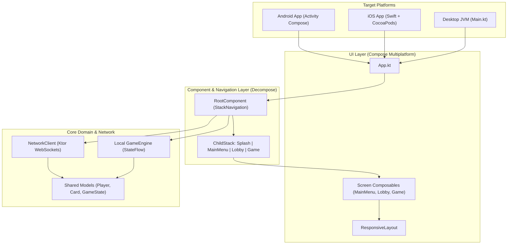

<div align="center">

# 🦝 RaccoonKMP

**Modern Multiplatform Card Game Client built with Compose Multiplatform & Kotlin Multiplatform (KMP) for Android, iOS, and Desktop.**

[](https://kotlinlang.org)
[](https://www.jetbrains.com/lp/compose-multiplatform/)
[](https://developer.android.com/)
[](https://developer.apple.com/ios/)
[](https://www.jetbrains.com/)
[](https://arkivanov.github.io/Decompose/)
[](https://www.gnu.org/licenses/agpl-3.0)

<p align="center">
  <a href="#-architectural-highlights">Architecture</a> •
  <a href="#-system-flow-diagram">System Flow</a> •
  <a href="#-project-structure">Project Structure</a> •
  <a href="#-how-to-run">How to Run</a> •
  <a href="#-testing--quality">Testing</a> •
  <a href="#-companion-server">Companion Server</a>
</p>

</div>

---

## 📖 Overview

**RaccoonKMP** is the multiplatform client application for the *Raccoon* card game. Built with **Kotlin Multiplatform (KMP)** and **Compose Multiplatform (CMP)**, it shares 100% of its UI, navigation, business rules, and networking across **Android**, **iOS**, and **Desktop (JVM)**.

The project demonstrates advanced Kotlin mobile and cross-platform architecture: leveraging **Decompose** for lifecycle-aware component navigation, **Ktor Client** with **WebSockets** for real-time multiplayer synchronization, and an embedded pure Kotlin **GameEngine** for local offline "Pass & Play" matches.

---

## ⚡ Architectural Highlights

* **100% Shared UI (Compose Multiplatform):**
  A single unified declarative UI codebase serving Android, iOS (via `ComposeUIViewController`), and Desktop. Employs responsive breakpoints (`ResponsiveLayout`) that adapt seamlessly from compact mobile screens to widescreen desktop monitors.

* **Lifecycle-Aware Component Architecture (Decompose):**
  Navigation and UI state management decoupled from view frameworks. Features a type-safe `ChildStack` (`RootComponent`), managing navigation across `Splash`, `MainMenu`, `Lobby`, `Game`, and `LocalGameSetup` with state restoration and back-stack handling across Android and iOS.

* **Dual Gameplay Modes:**
  * **Online Multiplayer:** Event-driven real-time gameplay connecting to [RaccoonServer](https://github.com/Shmbles/RaccoonServer) over WebSockets with strongly typed polymorphic JSON streams (`ClientAction` / `ServerEvent`).
  * **Local Pass & Play:** Standalone offline mode utilizing an embedded client-side `GameEngine` for multi-player games on a single device.

* **Robust Native iOS Integration:**
  Direct CocoaPods integration embedding the Kotlin Multiplatform static framework (`ComposeApp`) into Swift (`ViewController.swift`), bridging Essenty lifecycles and layout frames via `MainViewController.kt`.

* **Reactive Networking (`NetworkClient`):**
  Differentiates stateful game updates (`SharedFlow` with replay cache) from transient action confirmations and errors, alongside dynamic host resolution (`10.0.2.2` on Android emulators vs `127.0.0.1` on iOS/Desktop).

---

## 📐 System Flow Diagram



---

## 📂 Project Structure

```text
RaccoonKMP/
├── composeApp/
│   ├── src/
│   │   ├── commonMain/kotlin/com/shmbles/raccoon/
│   │   │   ├── App.kt                       # Root Compose entrypoint rendering ChildStack
│   │   │   ├── component/                   # Decompose navigation and state components
│   │   │   │   ├── RootComponent.kt         # Root coordinator & StackNavigation
│   │   │   │   ├── MainMenuComponent.kt     # Room creation / join logic
│   │   │   │   ├── LobbyComponent.kt        # Pre-game lobby room state
│   │   │   │   └── DefaultGameComponent.kt  # Gameplay action & event dispatcher
│   │   │   ├── engine/
│   │   │   │   └── GameEngine.kt            # Embedded pure Kotlin offline game engine
│   │   │   ├── model/
│   │   │   │   └── GameModels.kt            # GameState, Player, Card definitions
│   │   │   ├── network/
│   │   │   │   ├── ApiModels.kt             # ClientAction & ServerEvent contracts
│   │   │   │   └── NetworkClient.kt         # WebSocket client & event flows
│   │   │   └── ui/                          # Screen layouts, components & design system
│   │   │       ├── GameScreen.kt            # Interactive card table & player areas
│   │   │       ├── components/              # Buttons, steppers, responsive layout
│   │   │       └── theme/                   # Colors, typography, and Material 3 theme
│   │   ├── androidMain/                     # Android Activity & platform resource bindings
│   │   ├── iosMain/                         # MainViewController.kt & UIKit bridge
│   │   ├── jvmMain/                         # Desktop application runner (Main.kt)
│   │   └── commonTest/                      # Multiplatform test suites (Engine, Serialization)
│   └── build.gradle.kts                     # KMP, Compose, and target configurations
└── iosApp/
    ├── Podfile                              # CocoaPods configuration referencing composeApp
    ├── iosApp.xcworkspace                   # Xcode workspace
    └── iosApp/
        └── ViewController.swift             # Swift entrypoint embedding ComposeApp
```

---

## 🚀 How to Run

### Prerequisites
* **JDK 17 or 21**
* **Android Studio** (for Android and Desktop development)
* **Xcode 15+** & **CocoaPods** (for iOS development on macOS)

---

### 🖥️ 1. Running Desktop (macOS / Linux / Windows)

Run the Desktop application directly via Gradle:
```bash
./gradlew :composeApp:run
```

---

### 🤖 2. Running Android

1. Open the `RaccoonKMP` project in **Android Studio**.
2. Select the `composeApp` run configuration.
3. Choose an Android Emulator or connected physical device and click **Run** (`Shift + F10`).

---

### 🍏 3. Running iOS

1. Open the Xcode workspace:
   ```bash
   cd iosApp
   pod install
   open iosApp.xcworkspace
   ```
2. In Xcode, select your desired **iOS Simulator** (e.g., iPhone 15 / 16).
3. Press **Cmd + R** to build and run.

---

## 🧪 Testing & Quality

Run the shared multiplatform unit test suite:
```bash
./gradlew jvmTest
```

Verify compilation across all targets:
```bash
# Desktop
./gradlew compileKotlinJvm

# Android
./gradlew compileDebugKotlinAndroid

# iOS Simulator
./gradlew compileKotlinIosSimulatorArm64
```

---

## 🔗 Companion Server

This client connects to **[RaccoonServer](https://github.com/Shmbles/RaccoonServer)**, a real-time game server built with **Ktor**, **WebSockets**, and **Coroutines**.

---

## 📄 License

This project is licensed under the **GNU Affero General Public License v3 (AGPL-3.0)**. See the [LICENSE](LICENSE) file for details.

---

<div align="center">
  <sub>Developed with ❤️ by <a href="https://github.com/Shmbles">Andrés Díaz</a>.</sub>
</div>